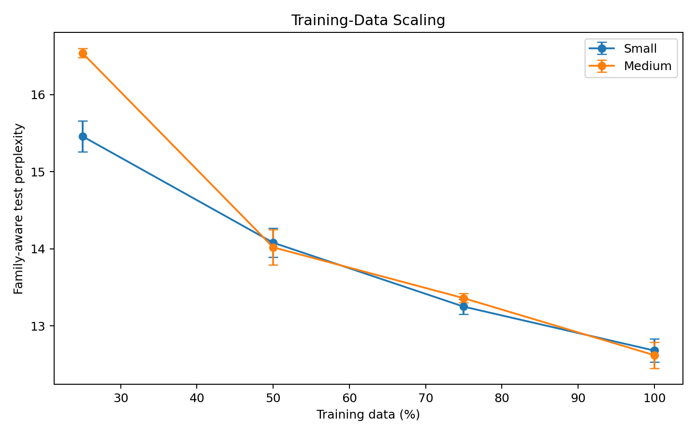
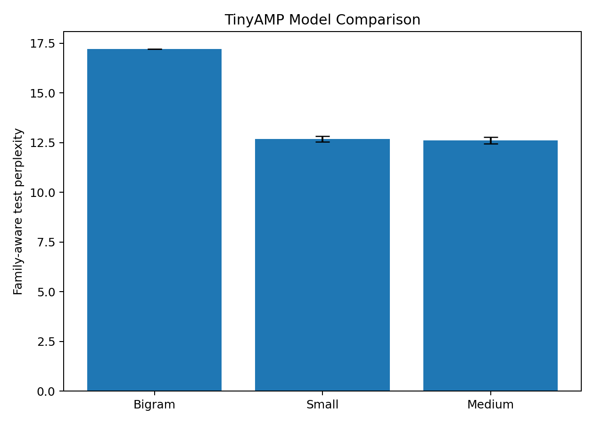

# TinyAMP

**Exploring data, model capacity, and generalization in a small peptide language model built from scratch.**

TinyAMP is a small autoregressive Transformer trained on natural antimicrobial-peptide (AMP) amino-acid sequences. The project was built as an educational computational-biology/ML study: rather than starting from a pretrained protein model, TinyAMP implements the causal Transformer directly in PyTorch and asks how much sequence structure can be learned from a comparatively small biological dataset.

The central result is simple: **sequence context matters, but more diverse training data was more useful than simply making the model larger.**



## Research questions

TinyAMP developed around five questions:

1. Does a causal Transformer model peptide sequences better than a bigram baseline?
2. How much does random train/test splitting overestimate generalization when closely related peptide sequences cross split boundaries?
3. Does increasing Transformer capacity improve generalization on a similarity-aware split?
4. Is overfitting better addressed by stronger dropout or by more training data?
5. Do independently trained models generate diverse sequences with AMP-like dataset statistics without being dominated by exact memorization?

## Dataset

The experiments used the **2024 APD6 natural AMP download containing 3,306 natural antimicrobial peptides with known activity** from the Antimicrobial Peptide Database (APD), University of Nebraska Medical Center. The raw FASTA is intentionally **not redistributed in this repository**. Download it from the official APD downloads page and cite the APD when using it.

After cleaning, all 3,306 downloaded sequences were retained: no duplicate sequences and no non-standard amino-acid sequences were removed in the run reported here.

See [DATASET.md](DATASET.md) for source and setup details.

## Models

TinyAMP uses a 22-token vocabulary: the 20 standard amino acids plus `<BOS>` and `<EOS>`.

| Model | Parameters | Embedding | Heads | Layers | Context |
|---|---:|---:|---:|---:|---:|
| Bigram | 484 | — | — | — | 1 residue |
| TinyAMP-Small | 106,624 | 64 | 4 | 2 | 64 tokens |
| TinyAMP-Medium | 805,632 | 128 | 4 | 4 | 64 tokens |

The Transformer is implemented directly in PyTorch with learned token and positional embeddings, causal multi-head self-attention, pre-LayerNorm residual blocks, GELU feed-forward layers, and autoregressive next-token prediction.

## Key results

### 1. Context beats the bigram baseline

On the similarity-aware split, the Bigram reached a test perplexity of **17.22**, while TinyAMP-Small averaged **12.68 ± 0.15** across three independent seeds.



### 2. Random splitting was optimistic

The original random-split Small model reached test perplexity **10.44**. After constructing an approximate similarity-aware split that kept sequences connected at ≥80% global alignment identity in the same partition, a single-seed Small run reached **12.59**. Held-out sequences had no verified ≥80%-identity match to training under the same approximate search procedure.

This split is best described as **similarity-aware**, not a definitive biological-family annotation. Candidate sequence pairs were prefiltered with shared 3-mers before global alignment, so the clustering is approximate.

### 3. A larger model did not reliably generalize better

Across three matched training seeds:

| Model | Family-aware test perplexity |
|---|---:|
| TinyAMP-Small | **12.68 ± 0.15** |
| TinyAMP-Medium | **12.62 ± 0.17** |

The difference was only ~0.5%, and Medium won only one of three paired seeds. Medium also reached its best validation checkpoint much earlier (mean step ~917 vs ~2500 for Small), showing substantially faster overfitting.

### 4. Stronger dropout delayed overfitting but did not improve the mean

For Medium, dropout 0.20 shifted the mean best checkpoint later but produced **12.73 ± 0.33** test perplexity versus **12.62 ± 0.17** with dropout 0.10.

### 5. More training data produced the clearest improvement

Both architectures improved monotonically as more similarity-aware training clusters were included.

| Training fraction | Small | Medium |
|---|---:|---:|
| 25% (661 seq.) | 15.46 ± 0.20 | 16.54 ± 0.06 |
| 50% (1,322 seq.) | 14.08 ± 0.19 | 14.02 ± 0.23 |
| 75% (1,983 seq.) | 13.25 ± 0.10 | 13.36 ± 0.06 |
| 100% (2,644 seq.) | **12.68 ± 0.15** | **12.62 ± 0.17** |

From 25% to 100% data, perplexity improved **18.0% for Small** and **23.7% for Medium**.

### 6. Family-aware generation remained diverse

Using the three best-validation Small checkpoints, 1,000 sequences were sampled from each model at temperature 1.0.

| Property | Real APD | Generated (pooled) |
|---|---:|---:|
| Mean length | 34.40 | 33.21 |
| Median length | 29 | 28 |
| Hydrophobic-residue fraction | 0.405 | 0.407 |
| Charged-residue balance `(K+R)-(D+E)` | 3.44 | 3.27 |

Across **3,000 generation attempts**, all 3,000 outputs were unique, only **2** exactly matched a training sequence, and none exactly matched validation or test sequences. Mean approximate nearest-training identity was 0.449; 3.4% of generated sequences were ≥80% identical to an approximate nearest training neighbor.

These generated sequences are **computational outputs only**. TinyAMP does not establish antimicrobial activity, toxicity, stability, structure, selectivity, or therapeutic utility.

See [RESULTS.md](RESULTS.md) for the full experimental narrative and caveats.

## Repository layout

```text
TinyAMP/
├── README.md
├── DATASET.md
├── METHODS.md
├── RESULTS.md
├── PROJECT_HISTORY.md
├── REFERENCES.md
├── pyproject.toml
├── requirements.txt
├── src/tinyamp/
│   ├── model.py
│   ├── data.py
│   ├── metrics.py
│   └── similarity.py
├── scripts/
│   ├── train_bigram.py
│   ├── train_model.py
│   ├── make_similarity_split.py
│   ├── generate.py
│   ├── analyze_generated.py
│   └── make_figures.py
└── results/
    ├── experiment_summary.csv
    ├── data_scaling.csv
    ├── repeated_seeds.csv
    ├── dropout.csv
    ├── generation_summary.csv
    └── figures/
```

Raw APD data and trained checkpoints are not bundled.

## Setup

Python 3.10+ is recommended.

```bash
python -m venv .venv
```

Activate the environment, then install:

```bash
pip install -e .
```

Place the APD FASTA somewhere on your computer and pass its path explicitly to scripts. Example:

```bash
python scripts/make_similarity_split.py --fasta path/to/naturalAMPs_APD2024a.fasta --output family_aware_split.csv
```

Train the family-aware bigram baseline or a Transformer from an existing split:

```bash
python scripts/train_bigram.py --split family_aware_split.csv --output-dir runs/bigram
python scripts/train_model.py --split family_aware_split.csv --model small --seed 42 --output-dir runs/small_seed42
```

Generate sequences from a saved checkpoint and optionally compare them with the split:

```bash
python scripts/generate.py --checkpoint runs/small_seed42/best.pt --output generated.csv --n 1000
python scripts/analyze_generated.py --generated generated.csv --split family_aware_split.csv --output generated_analysis.json
```

The included `results/` files are compact summaries of the completed experiments; they are sufficient to regenerate the portfolio figures:

```bash
python scripts/make_figures.py
```

## Methodological limits

- The similarity-aware split is an operational sequence-similarity split, **not** a curated biological family split.
- The custom nearest-neighbor search is approximate because it uses a shared-3-mer candidate prefilter before Needleman–Wunsch global alignment.
- Results reported as mean ± SD use only three training seeds and should be treated as descriptive, not as a formal statistical significance test.
- Nearest-neighbor similarity to train/validation/test is influenced by reference-set size; the training set is much larger than validation or test.
- `(K+R)-(D+E)` is a simple charged-residue balance, not a molecular net-charge calculation.
- AMP-like sequence statistics do not demonstrate biological activity.

## Portfolio summary

A concise description for a resume or project page:

> Built a causal peptide language model from scratch in PyTorch and evaluated it on 3,306 natural antimicrobial-peptide sequences. Developed a similarity-aware train/test split to reduce near-neighbor leakage, compared 484-parameter bigram and 106K/806K Transformer models, ran repeated-seed and data-scaling experiments, and analyzed 3,000 generated sequences for diversity, composition, and approximate memorization. Found that sequence context improved modeling substantially, while additional training-data diversity was more useful than simply increasing model capacity.

## Related work and acknowledgments

TinyAMP does not claim to introduce Transformer-based peptide generation. Related AMP/peptide language-model work includes AMP-Designer/AMP-GPT, BroadAMP-GPT, and Peptide-GPT. TinyAMP differs primarily in scale and experimental focus: it trains very small models from random initialization and emphasizes similarity-aware evaluation, data scaling, overfitting, repeated seeds, and memorization analysis rather than therapeutic design or wet-lab validation.

Andrej Karpathy's `nanoGPT` and educational GPT walkthrough were consulted as learning references for causal Transformer implementation. TinyAMP does not import or depend on nanoGPT; the peptide-specific pipeline and experiments were developed for this project.

ChatGPT was used as a coding and writing assistant during experiment planning, debugging, refactoring, interpretation checks, and documentation drafting. The reported experiments were run locally and reviewed by the project author, who is responsible for the repository and conclusions.

See [RELATED_WORK.md](RELATED_WORK.md) for the full positioning and acknowledgment statement.

## Citation

If you reference TinyAMP, GitHub can render citation information from [CITATION.cff](CITATION.cff). Please also cite the APD dataset source described in [DATASET.md](DATASET.md).

## References

See [REFERENCES.md](REFERENCES.md). The two foundational sources are the APD6 database paper and the original Transformer paper.
